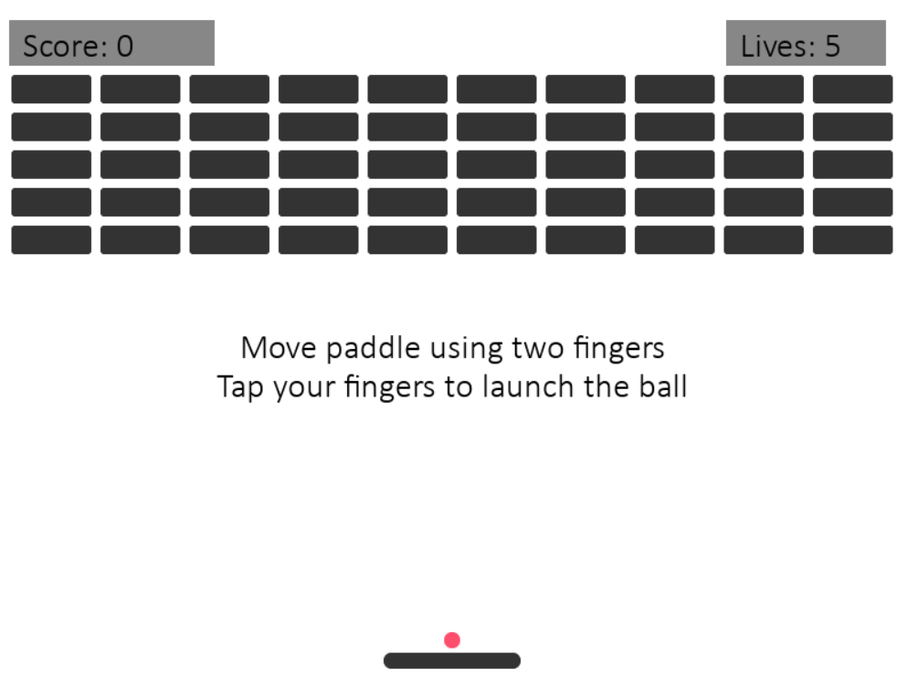
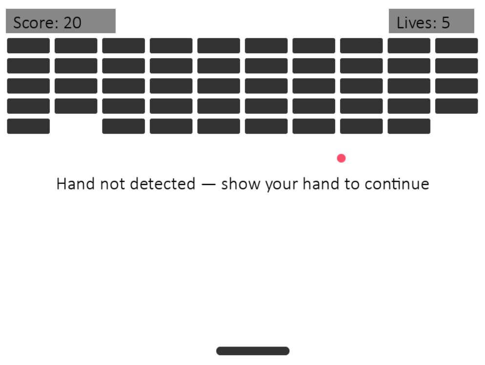

# Orbix — Gesture Controlled Brick Breaker

**Tagline:** *"Break bricks with the power of your hands!"*

## Project Overview
Orbix is a modern twist on the classic brick breaker game. Players control the paddle using hand gestures detected via their webcam. Move your hand left or right to control the paddle, and tap your fingers to launch the ball. The game features smooth ball physics, a dynamic brick layout, and a gradual increase in difficulty.

---

## Features
- **Hand-controlled Paddle:** Moves based on two-finger detection.
- **Ball Launch:** Tap gesture launches the ball.
- **Bricks:** 5 rows × 10 columns with gaps for challenging gameplay.
- **Scoreboard & Lifebar:** Score on the top-left, lives on the top-right.
- **Dynamic Ball Speed:** Gradually increases as bricks are hit.
- **Instructions & Detection Alerts:** Pre-launch instructions and “Hand not detected” messages if tracking fails.
- **Game Over Screen:** Options to replay or exit.

---

## How to Play
1. Place your hand in front of the webcam with your index and middle fingers up.
2. Move your hand left or right to control the paddle.
3. Tap your fingers (fold and release) to launch the ball.
4. Destroy all bricks to increase your score.
5. You have 5 lives; losing all ends the game.
6. Follow on-screen instructions and alerts.

---

## Installation

1. Clone the repository:
```bash
git clone https://github.com/yourusername/orbix.git
cd orbix
````

2. Install dependencies:

```bash
pip install -r requirements.txt
```

3. Ensure assets are in the `assets/` folder:

* `background.png`
* `ball.png`
* `paddle.png`
* `brick.png`

4. Run the game:

```bash
python main.py
```

---

## Controls

* Move hand left/right → Paddle moves.
* Tap fingers → Launch ball.

---

## Dependencies

* [Python 3.12+](https://www.python.org/)
* [Pygame](https://www.pygame.org/)
* [OpenCV](https://opencv.org/)
* [MediaPipe](https://developers.google.com/mediapipe)

---

## Challenges & Learnings

* Integrating real-time hand tracking with game mechanics.
* Ensuring smooth paddle movement and ball physics.
* Designing a responsive and visually clear UI for players.

---

## Future Improvements

* Multi-hand detection for multiplayer mode.
* Gesture-based power-ups or special moves.
* Mobile/web adaptation with built-in camera support.
* Adding sound effects and music.
* More levels and increasing complexity.

---

## Screenshots



---

